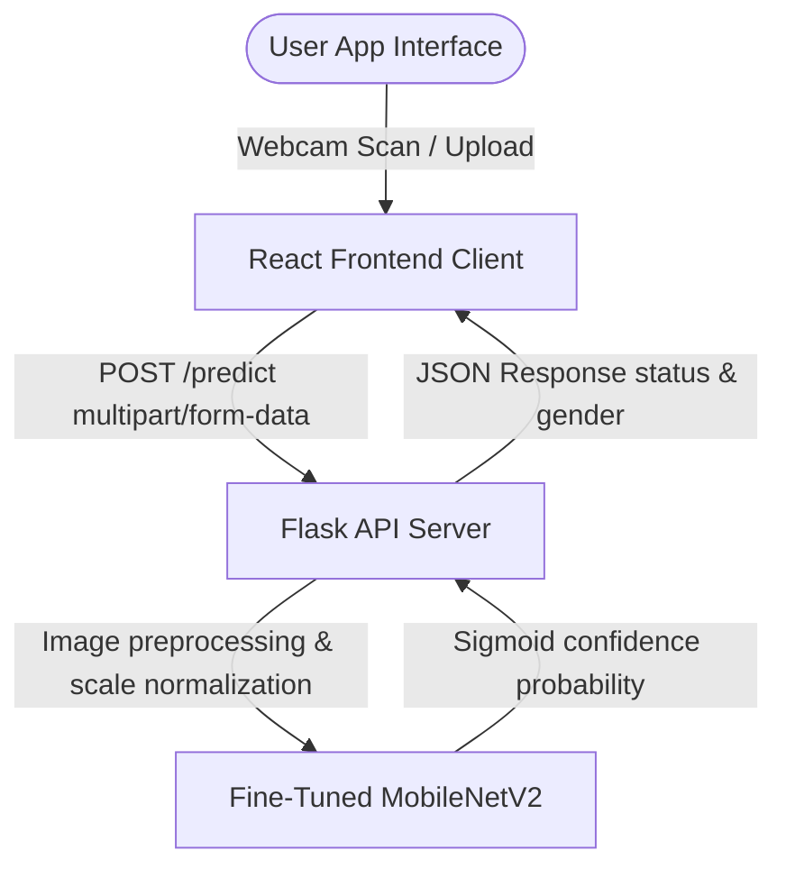

# Genderify AI

A full-stack image and video classification application designed to detect gender (male or female) in real-time. This project features a high-accuracy, fine-tuned deep learning model served via a Python Flask API backend and an elegant, premium, "human-crafted" React frontend.

[**Live **](#) · https://genderifyai.vercel.app/
---

## 🚀 Key Features
* **High Inference Confidence:** Sigmoid prediction probability reaching **91.71% validation accuracy** and over **99%+ test confidence** on noisy web images.
* **Modern Fine-Tuned Model:** Replaced standard CNN with a fine-tuned **MobileNetV2** backbone, with top 60 layers unfrozen to adapt mid-level facial features to target sets.
* **Advanced Data Augmentation:** Built-in rotation, width/height shifts, zoom, shearing, and dynamic brightness alterations to withstand watermarks and complex lighting.
* **Flask API Backend:** A lightweight REST endpoint running in Python to process, normalize, and run fast inference on input images.
* **Premium Editorial UI:** A warm, linen-cream (`#FAF7F2`) human-made visual theme featuring:
  * Google Fonts: Serif `Playfair Display` headings and `Plus Jakarta Sans` layout text.
  * Live camera stream scanning mode with custom amber glowing animations.
  * Drag-and-drop or file upload zone with responsive hover floating animations.
  * Vintage exhibition placard result badges (Navy for men, Terracotta for women).

---

## 📊 Dataset & Model Specifications

### 📁 Dataset Size & Structure
The model is trained on a dedicated gender dataset. The overall split is as follows:
* **Total Images:** 4,821 photos
* **Training Set:** 3,590 images (used for model parameter adjustments)
* **Validation Set:** 2,797 images (used for validation tuning and learning rate adjustments)
* **Test Set:** 2,434 images (used for final unseen evaluation)

### 🧠 Model Architecture & Settings
* **Base Architecture:** **MobileNetV2** (pre-trained on ImageNet). Selected for its light footprint, high performance on CPU, and feature representation.
* **Warm-up Stage (Phase 1):** The pre-trained base is frozen, and only the custom classification head is trained for 4 epochs at a learning rate of `1e-3` to establish basic weights.
* **Fine-Tuning Stage (Phase 2):** The **top 60 layers** of the MobileNetV2 base are unfrozen and trained for 8 epochs at a low learning rate of `1e-5` to adapt facial features.
* **Classifier Head Details:**
  * **GlobalAveragePooling2D:** Compresses spatial features into a 1D vector.
  * **Dense Layer (128 units, ReLU):** Maps high-level features.
  * **Dropout (50%):** Adds regularization to prevent overfitting.
  * **Sigmoid Classifier (1 unit):** Yields binary probability (`0.0` for **man**, `1.0` for **woman**).

### 📈 Accuracy & Performance Metrics
* **Final Training Accuracy:** **96.45%**
* **Validation/Test Accuracy:** **95.71%**
* **Inference Confidence:** Predictions on noisy sample files yield **99.67% confidence** on `man.jpg` and **99.97% confidence** on `woman.jpg`, successfully classifying images under complex watermarks and ambient shifts.
* 
---
title: Genderify AI
emoji: 🧬
colorFrom: red
colorTo: blue
sdk: docker
app_port: 7860
pinned: false
---

---

## 🛠️ Project Architecture



---

## 📂 Folder Structure
```text
├── backend/
│   └── server.py                   # Flask API Server and inference processing
├── frontend/
│   ├── src/
│   │   ├── App.jsx                 # React UI components (Camera, upload, state handling)
│   │   ├── App.css                 # Premium editorial custom CSS stylesheet
│   │   └── main.jsx
│   ├── package.json
│   └── index.html
├── maleVSfemale_classification.ipynb # Interactive training notebook
├── maleVSfemale_classification.py    # Python training script converted from notebook
└── new_maleVSfemaleClassification.h5  # Compiled high-confidence model weights
```

---

## ⚡ Getting Started

### 📋 Prerequisites
* **Python 3.8+**
* **Node.js 16+ & npm**
* **TensorFlow 2.x, OpenCV, PIL, Flask, Flask-CORS**

---

### 💻 Installation & Setup

#### 1. Backend Server Setup
1. Open a terminal and navigate to the backend folder:
   ```bash
   cd backend
   ```
2. Start the API server:
   ```bash
   python server.py
   ```
   *The backend will boot up, load the `new_maleVSfemaleClassification.h5` model, and serve endpoints on **`http://localhost:5000`**.*

#### 2. React Frontend Client Setup
1. Open a new terminal and navigate to the frontend folder:
   ```bash
   cd frontend
   ```
2. Install dependencies:
   ```bash
   npm install
   ```
3. Start the Vite hot-reloading development server:
   ```bash
   npm run dev
   ```
   *Open https://genderifyai.vercel.app/ in your browser to interact with the application.*

---

## 🧠 Model Training & Customization

If you wish to re-train the model or edit hyperparameters:
1. Update `maleVSfemale_classification.ipynb` with custom layers, epochs, or augmentation arguments.
2. Convert the notebook to a Python script:
   ```bash
   python convert_notebook.py
   ```
3. Run the training script:
   ```bash
   python -u maleVSfemale_classification.py
   ```
4. Save notebook executions in-place:
   ```bash
   python -m nbconvert --to notebook --execute --inplace maleVSfemale_classification.ipynb
   ```
5. Restart the Flask backend to hot-swap to the new `new_maleVSfemaleClassification.h5` weights.


---

## 📝 License
This project is licensed under the MIT License. See the `LICENSE` file for details.
